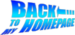

# ABOUT

This is the new and Inkscape-based version of Shlomi Fish’s web graphics
reading “Back to my Homepage” in the style of the logo of the film
[Back to the Future](http://en.wikipedia.org/wiki/Back_to_the_Future) .

Its homepage is now at http://www.shlomifish.org/art/back-to-my-homepage-2nd-ver/ .

The previous version, which was done using CorelDRAW, can be found at
[its page on Shlomi Fish’s site](http://www.shlomifish.org/art/bk2hp/),
but its CDR and resulting GIF may not be too usable.

# HOW TO USE

See the README file in the below directory for more information.

# LICENSE

The original logo of the _Back to the Future_ film, may be protected by
copyrights and trademarks, and since this logo emulates it, it may be
considered derivative work. The content itself is original, but uses some
GPLed and other open source code. As far as I'm (= Shlomi Fish) is
concerned the intermediate and final .svg files can be used under the CC-Zero
/ Public Domain (see https://creativecommons.org/publicdomain/zero/1.0/ ).
Crediting me as the originator of the works will be appreciated, but not
absolutely necessary.
